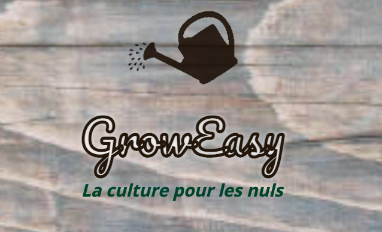

  

## ⚡ Introduction

 

_**Grow Easy** is a group project I participated in during my 3rd month training at the Wild Code School. It was a ProtoJam with the theme "disconnection", developed within 48 hours. **We were rewarded for having the most refined design.**_

**Concept:** the assigned theme was to encourage users to "disconnect and reconnect with nature". We decided to build a mobile app providing all the information  

**Team:** 2 web developers and 3 data analysts.

**Requirements:** the school required to develop a front-end application within 2 days, fetching the data scraped by the data analysts.

**Language:** 🇫🇷

 

## 🚀 Achievements 

 

I mainly focussed on designing the app and implementing the filter.

 

## 🔧 Technologies and tools

 

      

 

## ⭐ Final overview

 

<a href="https://youtu.be/kS0XWbPcnhM" target="blank">Check out how it looks</a>

 

  

